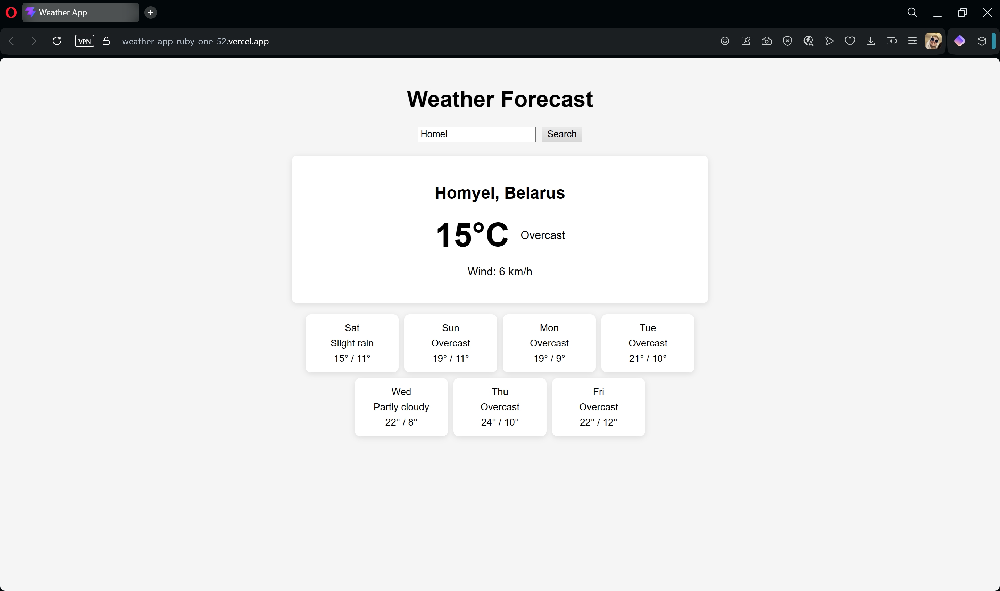

# Weather Forecast App

A single-page React application for searching cities and viewing current weather
conditions along with a 7-day forecast. Built with the free Open-Meteo API —
no API key required.


**Live Demo:** https://weather-app-ruby-one-52.vercel.app/

## Features

- City search via the Open-Meteo Geocoding API
- Current weather: temperature, wind speed and weather condition
- 7-day forecast with daily highs and lows
- Human-readable weather descriptions mapped from WMO weather codes
- Loading, error and empty states handled explicitly
- Search input disabled during a pending request to prevent duplicate calls

## Tech Stack

- React 18 (hooks: useState)
- Vite
- Open-Meteo API (geocoding + forecast)
- Plain CSS (no UI libraries)

## Getting Started

```bash
npm install
npm run dev
```

The app runs at http://localhost:5173.

## How It Works

The search flow is a two-step asynchronous pipeline:

1. The user enters a city name → the geocoding API resolves it to coordinates
2. The forecast API is queried with those coordinates → weather data is rendered

```
SearchBar → handleSearch() → searchCity() → getWeather() → CurrentWeather + ForecastList
```

All network logic lives in `src/utils/api.js`, separated from UI components.
Request state is managed as a status machine (`idle | loading | success | error`),
which prevents contradictory UI states.

## Key Concepts

- `fetch` with `async/await` and sequential dependent requests
- Checking `response.ok` — fetch does not reject on HTTP error statuses
- Status-machine pattern for request lifecycle
- Transforming "column-oriented" API data (`time[]`, `temperature_2m_max[]`, ...)
  into row-oriented objects for rendering
- Mapping numeric WMO weather codes to descriptions via a lookup object
- URL-safe user input with `encodeURIComponent`

## What I Learned

- Designing a clean separation between the API layer and UI components
- Handling both network failures and "logical" errors (e.g. city not found)
- Graceful UX for loading and error states
- Defensive coding against unexpected API values